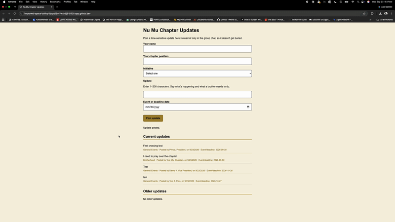
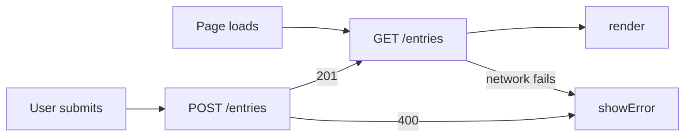

# Nu Mu Chapter Updates: Data Leaves the Browser

## What

*HW3 repository: https://github.com/Daedruoy/mgt3745-hw3*

This is a chapter management tool for Nu Mu, the Georgia Tech chapter of Alpha Phi Alpha Fraternity, Inc. It implements F-01/F-02 from [FEATURES.md](context/FEATURES.md): a chair submits a time-sensitive update through a form, and the system logs it with a server-assigned timestamp and displays it in a current-items view, split by submission recency, so it doesn't get buried the way updates currently do in group chats. See [PROJECT.md](context/PROJECT.md) for the full wicked problem this addresses. As of this week, entries live in Cloudflare D1 rather than the browser's localStorage, so data now survives a cleared cache and is visible from any device, not just the one it was entered on, per [ADR-002](context/ARCHITECTURE.md).

## See It Work

This demonstrates the "survive cleared cache" verification row in [FEATURES.md](context/FEATURES.md): an entry posted through the form is still visible when the page is loaded fresh in an incognito/private window, which has no access to the original session's browser storage. This proves data now lives on the server rather than the browser, the same evidence a cleared-cache test would show, since a private window and a wiped cache both start with zero local state.

## How to Run

Deployed: *`https://mgt3745-hw4.princemuteteke.workers.dev/entries`*

From a fresh Codespace:

1. Open the repository in a Codespace. The devcontainer installs xdg-utils and runs `npm install`.
2. `npx wrangler login --device`, then follow [docs/SESSION_B_COMMANDS.md](docs/SESSION_B_COMMANDS.md)
   to create the database, run the schema, and deploy.
3. Paste the deployed URL into `app.js` as `API`.
4. Right-click `index.html`, choose **Open with Live Server**.

To run the Worker locally instead: `npm run dev` (port 8787, local D1 emulator).

## Status

| Feature | EARS statement | Verdict |
|---|---|---|
| Save an update | WHEN a chair submits a time-sensitive update, THE SYSTEM SHALL log it to the central resource with a timestamp and surface it in the current-items view. | PASS |
| Reject incomplete submission | IF the POST /entries request body is missing a required field or the field is empty, THEN THE SYSTEM SHALL reject the submission with a 400 status naming the specific missing field. | PASS |
| Survive cleared cache | Data persists in D1 and is retrievable after a browser's local storage is cleared. | PASS |
| Two-week / older-updates split | WHEN a brother views the central resource, THE SYSTEM SHALL display items based on submission date, moving items older than two weeks to a separate section. | CANNOT TEST YET |
| Server unreachable | Page shows an error message to the user rather than throwing in the console when the network or server cannot be reached. | CANNOT TEST YET |
| Server returns 500 | Page shows a readable error rather than crashing when the Worker throws an unexpected error. | CANNOT TEST YET |
| Two clients, one table | Two chairs submitting updates at the same time do not corrupt or overwrite each other's entries. | DEFERRED (ADR-002) |
| Reminder flag, acknowledgment tracking, complete-details checklist, chair status update (F-03, F-04, F-06, F-07) | Out of scope for HW3 and HW4 builds. | DEFERRED (ADR-001) |

*Full verification table lives in [FEATURES.md](context/FEATURES.md).*

## Links

Reading order for a stranger: [PROJECT.md](context/PROJECT.md) →
[USERS.md](context/USERS.md) → [FEATURES.md](context/FEATURES.md) →
[ARCHITECTURE.md](context/ARCHITECTURE.md) → [STANDARDS.md](context/STANDARDS.md) →
[TOOLS.md](context/TOOLS.md) → [STYLE.md](context/STYLE.md) →
[CLAUDE.md](context/CLAUDE.md)

## AI Use

**Tool and task delegated:** Claude AI helped draft the Worker's structure (worker.js), including the CORS handling, the try/catch wrapper around the whole handler, the D1 binding check, and the validation logic for the five required fields. It also helped adapt app.js from localStorage calls to fetch calls against the deployed Worker.

**Why:** I'm still building my ability to read server-side code. Drafting a first working version let me focus my effort on understanding and verifying what the code actually does, rather than learning D1's SQL binding syntax and Cloudflare's Worker API from scratch under a deadline.

**How it was checked:** I traced through the bind() calls to confirm each ? in the SQL statement lines up with the corresponding argument in the .bind() call, in the same order (chair_name, chair_position, initiative, update_title, event_date), and confirmed no user value gets concatenated directly into a SQL string anywhere. I also tested the actual behavior with curl: a valid POST returned 201 with the correct data back, and an incomplete POST returned 400 naming the specific missing field, confirming the validation logic works as written.

**What I could not fully verify:** the RETURNING clause combined with .all() in the INSERT statement. I understand conceptually that it returns the newly created row, including the database-assigned id and created_at, in the same query, but I could not have written the exact syntax for that from scratch, and I'm trusting that results correctly holds the new row rather than something else. What I did about it: I used the curl test to confirm the response actually contained the new entry with a real id and timestamp, so the behavior is verified even though I can't fully explain D1's internals for why the query is structured that way.

**Actual hours on this assignment:** 7.5